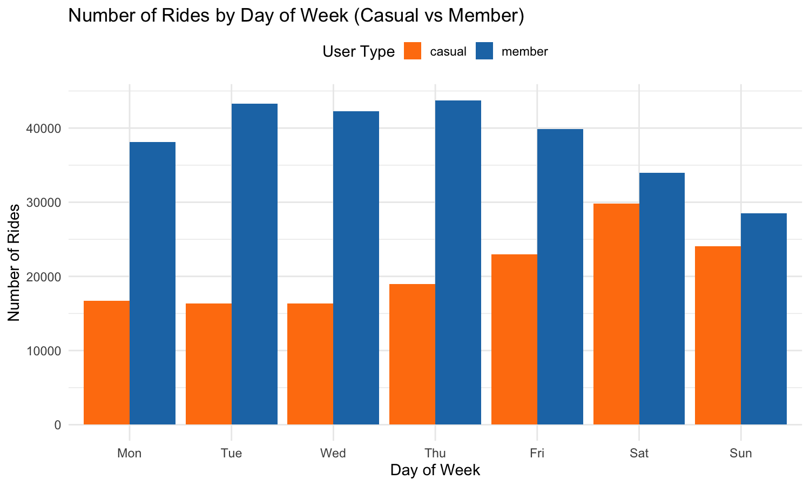
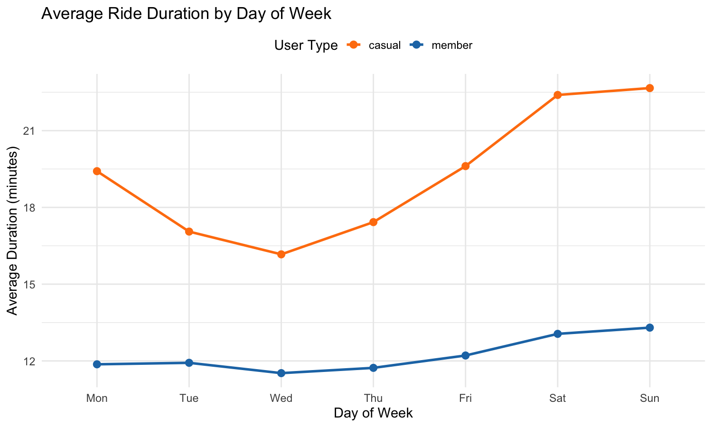

# Cyclistic Bike-Share Analysis – Google Data Analytics Capstone Project

This repository contains my capstone project for the **Google Data Analytics Professional Certificate**.  

I analyzed 13 months of Divvy (Cyclistic) bike-share trip data (Feb 2025 – Jan 2026) to understand key differences in usage patterns between **annual members** and **casual riders**. The goal is to provide data-driven insights to help convert casual riders into annual members.

## Business Task
How do annual members and casual riders use Cyclistic bikes differently?  
What marketing strategies could help convert casual riders to members?

## Key Findings
- **User distribution** (sample): ~65% annual members, ~35% casual riders
- **Ride duration**:
  - Casual: average **19.7 min** (median 11.8 min)
  - Members: average **12.2 min** (median 8.7 min)
- **By day of week** (Monday–Sunday):
  - Casual riders have longer rides on weekends (up to ~22 min on Sunday)
  - Members maintain shorter, more consistent rides (~12 min), slight increase toward weekend
  - Ride volume: members dominate weekdays (~2× more rides); casual riders catch up or overtake on weekends
- **By hour of day**:
  - Members show strong commuting peaks (morning 7–9 AM, evening 5–7 PM)
  - Casual rides are more evenly distributed, with a milder evening peak

## Visualizations
  
  

## Tools & Tech Stack
- **R** (dplyr, lubridate, ggplot2, readr)
- RStudio Desktop on macOS (Apple M3)
- Random sampling (~7.5%) for efficient analysis on large public dataset

## How to Reproduce
1. Download the 13 monthly CSV files from the official Divvy source:  
   https://divvy-tripdata.s3.amazonaws.com/index.html (Feb 2025 – Jan 2026)
2. Place downloaded CSVs in a local `Raw_Data/` folder
3. Run the scripts in order:
   - `Scripts/cyclistic_step1_load_and_sample.R`
   - `Scripts/cyclistic_step2_sample_clean.R`
   - `Scripts/cyclistic_step3_analyze_viz.R`
4. Visualizations will be saved in the `Visuals/` folder

**Note**: The full dataset is public and very large (~5–6 million rows). This project uses a representative random sample for demonstration.

## Top 3 Recommendations
1. **Weekend promotions for casual riders**  
   Offer trial or discounted annual memberships on Fridays–Sundays when casual usage and ride durations peak.

2. **Target commute-time digital campaigns**  
   Run social media/email ads during peak member hours (7–9 AM & 5–7 PM) highlighting cost/time savings for frequent short trips.

3. **Station- and behavior-based targeting**  
   Identify high-traffic casual stations (tourist/leisure areas) and promote membership flexibility for both commuting and recreational use.

## Full Report
Detailed analysis, methodology and conclusions:  
[Cyclistic_Report.md](Cyclistic_Report.md)

Feel free to explore the code and visuals!
